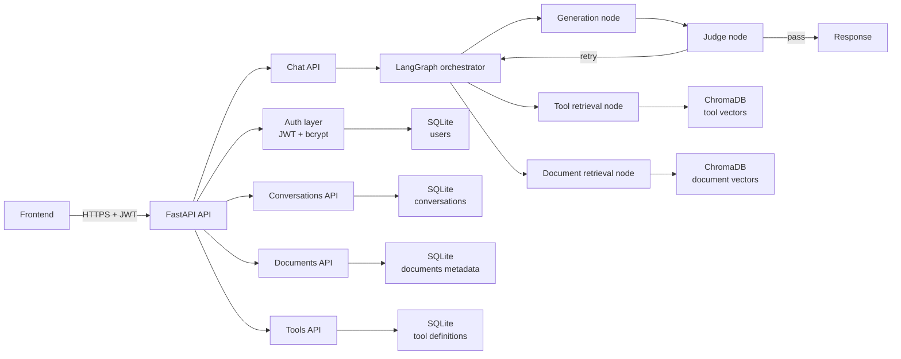

# Cents Backend

Cents is a multi-user RAG chatbot backend built with Python 3.12, FastAPI, LangGraph, SQLite, and ChromaDB.

This repository now uses a single backend stack:
- relational/auth/conversation data in SQLite
- vector storage and similarity search in ChromaDB

PostgreSQL, pgvector, Alembic, Docker Compose, and WSL are not required for normal development.

## High-level architecture



## What this project includes

- FastAPI backend with CORS support
- JWT auth via local auth routes and bcrypt password hashing
- Conversation CRUD (user-scoped)
- SSE chat endpoint backed by LangGraph orchestration
- Document ingestion into SQLite + Chroma
- Tool registration into SQLite + Chroma

## Project structure

```text
app/
├── auth/
│   └── users.py
├── db/
│   ├── base.py
│   └── models.py
├── graph/
│   ├── state.py
│   ├── orchestrator.py
│   ├── retrieval_tools.py
│   ├── retrieval_docs.py
│   ├── generation.py
│   ├── judge.py
│   ├── graph.py
│   └── checkpointer.py
├── routes/
│   ├── conversations.py
│   ├── chat.py
│   ├── documents.py
│   └── tools.py
├── vector_store.py
├── config.py
└── main.py
```

## Python version

Python 3.12 is required.

## Setup

### Windows (native)

From the repository root:

```powershell
scripts\setup.bat
scripts\start.bat
```

Alternative PowerShell scripts:

```powershell
powershell -NoProfile -ExecutionPolicy Bypass -File .\scripts\setup.ps1
powershell -NoProfile -ExecutionPolicy Bypass -File .\scripts\start.ps1
```

### macOS / Linux

```bash
chmod +x scripts/setup.sh scripts/start.sh
./scripts/setup.sh
./scripts/start.sh
```

## Manual setup (all platforms)

On macOS/Linux:

```bash
python3.12 -m venv .venv
.venv/bin/python -m pip install --upgrade pip
.venv/bin/python -m pip install -r requirements.txt
.venv/bin/python -c "import asyncio; from app.db.base import init_db; from app.vector_store import ensure_vector_store_ready; asyncio.run(init_db()); ensure_vector_store_ready()"
.venv/bin/python -m uvicorn app.main:app --reload --host 0.0.0.0 --port 8000
```

On Windows native, use `.venv\Scripts\python.exe` instead of `.venv/bin/python`.

## Start commands

Windows (CMD):

```bat
scripts\start.bat
```

Windows (PowerShell):

```powershell
powershell -NoProfile -ExecutionPolicy Bypass -File .\scripts\start.ps1
```

macOS / Linux:

```bash
./scripts/start.sh
```

## Environment

This project uses one environment file: `.env`.

Important variables:
- DATABASE_URL
- JWT_SECRET
- CORS_ORIGINS
- VECTOR_DIMENSION
- CHROMA_PERSIST_DIRECTORY
- CHROMA_DOCUMENTS_COLLECTION
- CHROMA_TOOLS_COLLECTION

Default local values already target SQLite + Chroma.

## Notes

- Current vector embeddings are placeholders (zero vectors) until model integration is added.
- SQLite stores the relational records; Chroma stores the vectors and similarity index.
- On startup, if the local SQLite database file does not exist, it is created automatically.
- Local runtime artifacts such as `cents.db`, `.chroma/`, and `*.log` are git-ignored.
