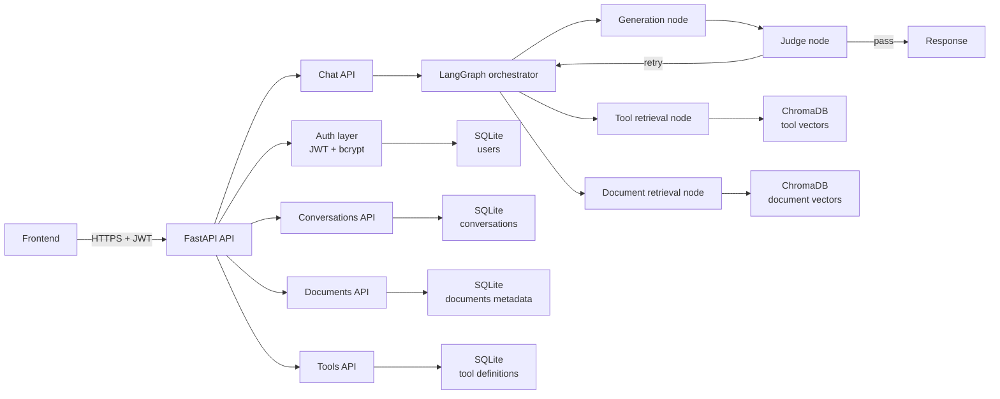

# Cents Backend

Cents is a multi-user RAG chatbot backend built with Python 3.12, FastAPI, LangGraph, SQLite, and ChromaDB.

This repository now uses a single backend stack:
- relational/auth/conversation data in SQLite
- vector storage and similarity search in ChromaDB

PostgreSQL, pgvector, Alembic, Docker Compose, and WSL are not required for normal development.

## High-level architecture



## What this project includes

- FastAPI backend with CORS support
- JWT auth via local auth routes and bcrypt password hashing
- Conversation CRUD (user-scoped)
- SSE chat endpoint backed by LangGraph orchestration
- Document ingestion into SQLite + Chroma with embedding-backed vector indexing
- Tool management (create/update/enable/disable/delete) in SQLite + Chroma with enabled-only retrieval
- Hybrid sub-agent routing that uses agent descriptions for semantic selection (name match, embedding rank, lexical fallback)

## Project structure

```text
app/
├── agents/
│   ├── __init__.py
│   ├── compiler.py
│   ├── state.py
│   └── template_schema.py
├── auth/
│   └── users.py
├── db/
│   ├── base.py
│   └── models.py
├── graph/
│   ├── state.py
│   ├── orchestrator.py
│   ├── retrieval_tools.py
│   ├── retrieval_docs.py
│   ├── generation.py
│   ├── judge.py
│   ├── graph.py
│   └── checkpointer.py
├── routes/
│   ├── agents.py
│   ├── conversations.py
│   ├── chat.py
│   ├── configuration.py
│   ├── documents.py
│   └── tools.py
├── vector_store.py
├── config.py
└── main.py

tests/
├── test_agent_compiler.py
└── test_agent_template_schema.py
```

## How to understand the app quickly

If you are new to the codebase, read in this order:

1. `app/main.py`: app startup lifecycle, dependency wiring, and route registration.
2. `app/routes/`: API surface area (auth, conversations, documents, tools, chat).
3. `app/graph/graph.py`: orchestration graph and retry loop boundaries.
4. `app/graph/*.py`: per-node behavior (routing, retrieval, generation, judging).
5. `app/db/models.py` and `app/vector_store.py`: relational vs vector persistence responsibilities.
6. `app/config.py`: runtime settings and environment-driven behavior.

## Main chat orchestration and routing policy

The top-level chat graph in `app/graph/graph.py` routes through `orchestrator -> retrieval -> generation -> judge`.

The orchestrator (`app/graph/orchestrator.py`) now applies a hybrid policy for sub-agent selection:

1. Load enabled, valid agent templates from `agent_templates` and keep the latest version per agent name.
2. Try direct name match against the user message.
3. If no name match, rank candidates by embedding similarity of `"<agent name>. <agent description>"`.
4. If embedding selection is unavailable, use lexical overlap fallback.
5. Attempt a bounded number of ranked candidates; execute the first candidate that produces a terminal response.
6. If no sub-agent is selected, fall back to deterministic top-level routing (`tools`, `docs`, `both`, `direct`).

Selection metadata is persisted in graph state as `selected_agent` for observability (`name`, `version`, `description`, `selection_mode`, `selection_score`).

### Retrieval behavior

- Tool retrieval (`app/graph/retrieval_tools.py`) embeds the user query and filters vectors by `enabled=true`.
- Document retrieval (`app/graph/retrieval_docs.py`) embeds the user query before vector search.
- Document upload (`app/routes/documents.py`) now embeds chunk text during ingestion so document search is semantic, not placeholder-based.

This follows a two-stage retrieval pattern: high-recall semantic candidate lookup first, then constrained downstream generation/judging.

## Agent workflow templates (schema-first)

The backend now includes formal workflow schema models in `app/agents/template_schema.py`.
Validated templates are compiled into isolated executable graphs in `app/agents/compiler.py`.

### Why this exists

- Lets platform builders define agent workflows as validated JSON data.
- Decouples template authoring from hardcoded graph construction logic.
- Provides deterministic validation errors before runtime execution.

### Template shape

- `AgentTemplate`
    - `template_version`
    - `entry_node`
    - `nodes: list[AgentNode]`
    - `guardrails`
- `AgentNode` is a discriminated union on `type` with variants:
    - `structured_parser`
    - `condition`
    - `service_call`
    - `user_interrupt`
    - `llm_step`
    - `terminal_response`
- Transition rules:
    - Non-terminal nodes use `next`
    - `condition` nodes use `branches` and must include a `default` key
    - `structured_parser` nodes can optionally define `on_failure`
    - `service_call` nodes can optionally define `on_failure`
    - `terminal_response` nodes end execution

### Validation behavior

Use `validate_template(raw_json)` to parse and validate templates. It checks:

1. Schema conformance and field-level constraints.
2. `entry_node` exists in `nodes`.
3. All `next` and `branches` targets exist.
4. No unreachable nodes (orphans) from `entry_node`.
5. At least one `terminal_response` exists.
6. Every node can reach a `terminal_response`.

### Compilation behavior

- `compile_agent_graph(template)` builds a standalone LangGraph `StateGraph` from the template.
- Node execution is dispatched by node `type` through a compiler dispatch table.
- `entry_node` is used as the graph entry point.
- `next` and `branches` are translated into LangGraph edges.
- `condition` evaluates a safe allow-listed expression against `parsed_data` and `service_results` (no arbitrary `eval`).
- Condition expression results resolve to branch keys; unmatched keys and evaluation errors route to `default`.
- Condition evaluation errors are captured for observability instead of crashing the graph.
- `structured_parser` supports deterministic extraction (`regex`/keyword) and LLM extraction (`llm`).
- Parser output is merged into `parsed_data` by field name so multiple parser nodes can contribute fields.
- Parser failures route to `on_failure` when configured, otherwise the run raises a clear parser error.
- `terminal_response` renders its template using `parsed_data`, `messages`, and `service_results`, then writes the rendered text to `final_response`.
- `terminal_response` is an explicit terminal node and always routes to `END` (distinct from interrupt and error paths).
- `user_interrupt` renders a prompt template from current state and pauses execution using LangGraph interrupts.
- Interrupt-capable templates are compiled with a persistent SQLite checkpointer based on `DATABASE_URL`, so pause state survives process restarts when resumed with the same `thread_id`.
- Resuming with `Command(resume=<answer>)` continues from the interrupted node's `next` and merges the answer into `parsed_data[output_key]` plus `messages`.
- `service_call` supports:
    - `mode=http`: configured `url` + `method`, with header/body template interpolation from state
    - `mode=tool`: reference to a registered `ToolDefinition` by `tool_name` or `tool_id`, with optional `tool_input_template`
- `llm_step` supports a single scoped LLM call with explicit `model_type`, `temperature`, `max_tokens`, and templated `system_prompt`.
- `llm_step` `system_prompt` placeholders are limited to `parsed_data.*` and `service_results.*` to prevent implicit full-state prompt injection.
- `llm_step` writes generated text to `messages` and can optionally persist to `parsed_data[output_key]`.
- `llm_step` LLM client failures route to `on_failure` when configured, otherwise they raise a runtime error.
- HTTP service calls are SSRF-protected via `SERVICE_CALL_ALLOWED_HOSTS` unless unsafe destinations are explicitly enabled server-side.
- Sensitive headers/body fields must reference server-side secrets using placeholders (for example `{{ secret.my_api_key }}`), never hardcoded values in templates.
- Service call responses are stored at `service_results[node_id]`.
- Tool-mode service calls first use a registered in-process executor when present; otherwise they execute persisted tool `python_code` via the configured entrypoint.
- Non-2xx responses and timeouts route to `on_failure` when configured; otherwise they raise a clear runtime error.
- Compiled graphs are cached per `(name, version)` for reuse.

### Minimal example

```json
{
    "template_version": "1.0",
    "entry_node": "parse_request",
    "guardrails": {
        "max_iterations": 3,
        "banned_topics_override": ["medical advice"],
        "judge_enabled_override": true
    },
    "nodes": [
        {
            "id": "parse_request",
            "type": "structured_parser",
            "config": {
                "source_key": "last_message",
                "strategy": "regex",
                "regex_patterns": {
                    "amount": "amount\\\\s*[:=]\\\\s*(-?\\\\d+(?:\\\\.\\\\d+)?)"
                },
                "fields": [{"name": "amount", "type": "number"}]
            },
            "on_failure": "fallback_response",
            "next": "respond"
        },
        {
            "id": "fallback_response",
            "type": "terminal_response",
            "config": {"template": "Could not parse input."}
        },
        {
            "id": "respond",
            "type": "terminal_response",
            "config": {"template": "Done"}
        }
    ]
}
```

### Tests for schema validation

Template validation tests live in `tests/test_agent_template_schema.py`.

Run them with:

```powershell
.\.venv\Scripts\python.exe -m pytest tests/test_agent_template_schema.py -q
```

## Agent templates API

The backend exposes versioned template management for sub-agent workflows.

Endpoints:

- POST /agents
    - Creates version 1 for a new template name.
    - Runs template validation and stores `is_valid` plus `validation_errors`.
- GET /agents
    - Returns the latest version for each template name.
- GET /agents/{name}
    - Returns latest version details for a single template name.
- GET /agents/{name}/versions
    - Returns full version history for a template name.
- PUT /agents/{name}
    - Creates a new version instead of mutating existing history.
- PATCH /agents/{name}/enabled
    - Enables or disables a template version.
    - Rejects enable=true for invalid templates with HTTP 400.
    - Enforces one-active-version policy per agent name:
        - enabling one version disables all others for that name
        - disabling the last active version is rejected with HTTP 400
- DELETE /agents/{name}
    - Deletes all versions for that template name.

### Agent authoring metadata and dry-run validation

These endpoints support natural-language, visual, and JSON editor experiences without creating temporary database rows.

Endpoints:

- GET /agents/authoring/schema
    - Returns a versioned authoring catalog derived from the Pydantic workflow schema.
    - Includes supported node types, config field metadata (type/default/required/options), and transition kinds.
- POST /agents/authoring/validate
    - Accepts `{ "raw_template": { ... } }` and runs non-persisting validation.
    - Returns:
        - `is_valid`
        - `normalized_template` when the payload is parseable
        - structured `errors` with `path`, optional `node_id`, and `message`
    - Does not create, update, delete, compile, or enable `AgentTemplate` records.
- POST /agents/authoring/generate
    - Accepts a complete natural-language workflow source and an optional current template.
    - Supplies the live schema catalog to the configured generation model.
    - Requires a complete `{ "message": ..., "template": ... }` JSON response.
    - Validates the generated template before returning it to the editor; invalid output is returned with structured errors and is not applied by the frontend.
    - Reports explicit `@node_id` references while excluding reserved authoring directives.

### Natural-language authoring contract

The authoring notation is intentionally line-oriented and indentation-friendly. It is an authoring layer only: the validated `AgentTemplate` remains the executable and persisted representation.

| Directive | Canonical capability |
| --- | --- |
| `@start <instruction>` | Select or describe the entry step. |
| `@listen <fields and source>` | Create a `structured_parser`, including field types and regex or LLM extraction when stated. |
| `@if <condition>` | Create a `condition` and its matching branch. |
| `@else if <condition>` | Add another named condition branch. |
| `@else` | Add the required default branch. |
| `@call <HTTP request or tool>` | Create an HTTP-mode or tool-mode `service_call`; tool mode must include `tool_name` or `tool_id` and can include `tool_input_template`. |
| `@interrupt <request>` | Create a checkpointed `user_interrupt`, including answer type, choices, and output key when stated. |
| `@think <instruction>` | Create an `llm_step`, including model options and output key when stated. |
| `@reply <response>` | Create a success, failure, or cancelled `terminal_response`. |
| `@on_failure <instruction>` | Attach an error route to the preceding parser, service call, or LLM step. |
| `@guardrails <policy>` | Set maximum iterations, banned topics, and judge overrides. |

Plain text may be used between directives. Indentation associates text with the nearest directive, and document order provides the default sequence. Explicit component references use `@node_id`; directive names are reserved and are not treated as component IDs.

Graph-state references use `{{ state.<path> }}` in authoring source. The generator maps them to the subset supported by the target node schema. Runtime data currently includes `input`, `parsed_data`, `messages`, and `service_results`; individual node types deliberately expose narrower subsets. For example, conditions evaluate `parsed_data` and `service_results`, while terminal responses may also render `messages`.

The generation model is not trusted as the execution boundary. Pydantic parsing, graph reachability checks, terminal-path checks, safe condition evaluation, scoped placeholder resolution, and service-call protections remain authoritative after generation.

This design follows the same separation used by readable specification formats such as [Gherkin](https://cucumber.io/docs/gherkin/reference/): concise structural keywords for authors, followed by deterministic validation. Interrupt behavior maps directly to [LangGraph interrupts](https://docs.langchain.com/oss/python/langgraph/interrupts), including checkpointed pause and resume.

### Sub-agent run streaming

Long-running template execution now supports server-sent event (SSE) streaming.

Endpoints:

- POST /agents/{name}/runs
    - Starts a new run and streams progress with `text/event-stream`.
    - Generates user-scoped `run_id` and `thread_id` values using a `user_id:token` pattern.
    - Uses the cached compiled graph for the selected template version.
- POST /agents/runs/{run_id}/resume
    - Resumes an interrupted run from checkpointed state with a user answer.
    - Streams the same event format until the next interrupt or terminal completion.
- GET /agents/runs/{run_id}
    - Returns current run status and iteration count for polling/list views.

SSE framing:

- `data: {json}\n\n`

Emitted events include:

- `node_started` with `node_id`, `type`
- `node_completed` with `node_id`, `duration`
- `interrupt_requested` with `node_id`, `prompt`
- `error` with `node_id`, `message`
- `done` with either `final_response` (completed) or `awaiting_input: true` (paused)

Run status values:

- `running`
- `awaiting_input`
- `succeeded`
- `failed`

All run endpoints require an authenticated active user and are scoped to the requesting user.

## Platform configuration API

The backend now exposes editable platform guardrails that can be updated without redeploying.

Endpoints:

- GET /configuration
    - Returns the singleton platform configuration row.
    - Creates the default row on first read if it does not exist.
- PUT /configuration
    - Updates guidelines and guardrails:
        - guidelines_text
        - banned_topics
        - judge_enabled
        - max_retries

Validation:

- `max_retries` must be greater than or equal to 0.
- `guidelines_text` is capped at 8000 characters.

All endpoints require an authenticated active user.

## Python version

Python 3.12 is required.

## Setup

### Windows (native)

From the repository root:

```powershell
scripts\setup.bat
scripts\start.bat
```

Alternative PowerShell scripts:

```powershell
powershell -NoProfile -ExecutionPolicy Bypass -File .\scripts\setup.ps1
powershell -NoProfile -ExecutionPolicy Bypass -File .\scripts\start.ps1
```

### macOS / Linux

```bash
chmod +x scripts/setup.sh scripts/start.sh
./scripts/setup.sh
./scripts/start.sh
```

## Manual setup (all platforms)

On macOS/Linux:

```bash
python3.12 -m venv .venv
.venv/bin/python -m pip install --upgrade pip
.venv/bin/python -m pip install -r requirements.txt
.venv/bin/python -c "import asyncio; from app.db.base import init_db; from app.vector_store import ensure_vector_store_ready; asyncio.run(init_db()); ensure_vector_store_ready()"
.venv/bin/python -m uvicorn app.main:app --reload --host 0.0.0.0 --port 8000
```

On Windows native, use `.venv\Scripts\python.exe` instead of `.venv/bin/python`.

## Start commands

Windows (CMD):

```bat
scripts\start.bat
```

Windows (PowerShell):

```powershell
powershell -NoProfile -ExecutionPolicy Bypass -File .\scripts\start.ps1
```

macOS / Linux:

```bash
./scripts/start.sh
```

## Environment

This project uses one environment file: `.env`.

Important variables:
- DATABASE_URL
- JWT_SECRET
- CORS_ORIGINS
- VECTOR_DIMENSION
- CHROMA_PERSIST_DIRECTORY
- CHROMA_DOCUMENTS_COLLECTION
- CHROMA_TOOLS_COLLECTION
- LLM_SERVICE_BASE_URL
- LLM_SERVICE_GENERATE_PATH
- LLM_SERVICE_MODELS_PATH
- LLM_SERVICE_API_KEY
- LLM_SERVICE_TIMEOUT_SECONDS
- LLM_DEFAULT_GENERATION_MODEL_TYPE
- LLM_DEFAULT_GENERATION_MODEL
- LLM_DEFAULT_JUDGE_MODEL_TYPE
- LLM_DEFAULT_JUDGE_MODEL
- LLM_JUDGE_ENABLED
- LLM_DEFAULT_TEMPERATURE
- LLM_DEFAULT_MAX_TOKENS
- SERVICE_CALL_ALLOWED_HOSTS
- SERVICE_CALL_ALLOW_UNSAFE_DESTINATIONS
- SERVICE_CALL_DEFAULT_TIMEOUT_SECONDS
- SERVICE_CALL_SECRETS

Default local values already target SQLite + Chroma.

## LLM Service Dependency

`cents-backend` now delegates generation calls to the sibling `cents-llm` service.

Recommended local run order:

1. Start Ollama and pull a starter model (for example `qwen2.5:3b-instruct`).
2. Start `cents-llm` on `http://127.0.0.1:8100`.
3. Start `cents-backend`.

If `LLM_SERVICE_API_KEY` is configured in `cents-llm`, set the same value in backend `.env`.

## Multi-model Routing

The backend can use different models per conversation and per graph node.

### Get available models

- `GET /chat/models`
- Requires auth
- Returns model list from `cents-llm` plus backend defaults and supported node keys.

### Set conversation model config

- `GET /conversations/{conversation_id}/model-config`
- `PUT /conversations/{conversation_id}/model-config`

Payload shape for `PUT`:

```json
{
    "node_llm_configs": {
        "generation": {
            "model_type": "text-generation",
            "model": "qwen2.5:3b-instruct"
        },
        "judge": {
            "model_type": "reasoning"
        }
    }
}
```

### Per-request model override

`POST /chat` accepts optional fields:

- `node_llm_configs`: per-node map where each entry includes required `model_type` and optional `model`

Request body example:

```json
{
    "conversation_id": "...",
    "message": "Summarize the latest updates",
    "node_llm_configs": {
        "generation": {
            "model_type": "text-generation"
        },
        "judge": {
            "model_type": "reasoning",
            "model": "llama3.2:3b-instruct"
        }
    }
}
```

Rules:

- For every node that triggers an LLM call, `model_type` is required.
- `model` is optional per node. If omitted, `cents-llm` resolves the default model for that `model_type` folder.

## Notes

- Current vector embeddings are placeholders (zero vectors) until model integration is added.
- SQLite stores the relational records; Chroma stores the vectors and similarity index.
- On startup, if the local SQLite database file does not exist, it is created automatically.
- Local runtime artifacts such as `cents.db`, `.chroma/`, and `*.log` are git-ignored.
