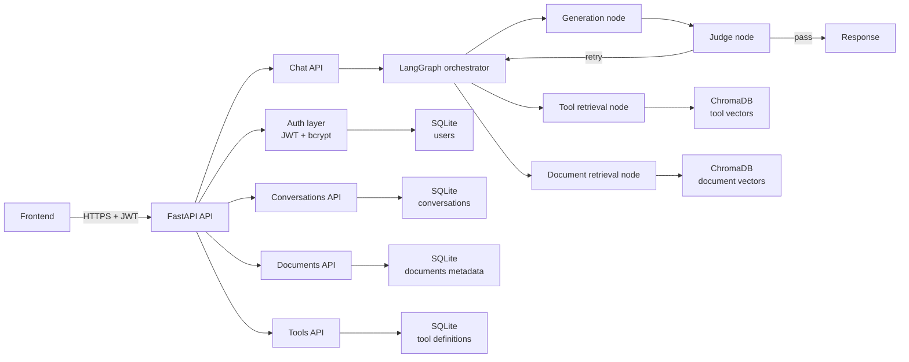

# Cents Backend

Cents is a multi-user RAG chatbot backend built with Python 3.12, FastAPI, LangGraph, SQLite, and ChromaDB.

This repository now uses a single backend stack:
- relational/auth/conversation data in SQLite
- vector storage and similarity search in ChromaDB

PostgreSQL, pgvector, Alembic, Docker Compose, and WSL are not required for normal development.

## High-level architecture



## What this project includes

- FastAPI backend with CORS support
- JWT auth via local auth routes and bcrypt password hashing
- Conversation CRUD (user-scoped)
- SSE chat endpoint backed by LangGraph orchestration
- Document ingestion into SQLite + Chroma
- Tool registration into SQLite + Chroma

## Project structure

```text
app/
├── agents/
│   ├── __init__.py
│   ├── compiler.py
│   ├── state.py
│   └── template_schema.py
├── auth/
│   └── users.py
├── db/
│   ├── base.py
│   └── models.py
├── graph/
│   ├── state.py
│   ├── orchestrator.py
│   ├── retrieval_tools.py
│   ├── retrieval_docs.py
│   ├── generation.py
│   ├── judge.py
│   ├── graph.py
│   └── checkpointer.py
├── routes/
│   ├── agents.py
│   ├── conversations.py
│   ├── chat.py
│   ├── documents.py
│   └── tools.py
├── vector_store.py
├── config.py
└── main.py

tests/
├── test_agent_compiler.py
└── test_agent_template_schema.py
```

## How to understand the app quickly

If you are new to the codebase, read in this order:

1. `app/main.py`: app startup lifecycle, dependency wiring, and route registration.
2. `app/routes/`: API surface area (auth, conversations, documents, tools, chat).
3. `app/graph/graph.py`: orchestration graph and retry loop boundaries.
4. `app/graph/*.py`: per-node behavior (routing, retrieval, generation, judging).
5. `app/db/models.py` and `app/vector_store.py`: relational vs vector persistence responsibilities.
6. `app/config.py`: runtime settings and environment-driven behavior.

## Agent workflow templates (schema-first)

The backend now includes formal workflow schema models in `app/agents/template_schema.py`.
Validated templates are compiled into isolated executable graphs in `app/agents/compiler.py`.

### Why this exists

- Lets platform builders define agent workflows as validated JSON data.
- Decouples template authoring from hardcoded graph construction logic.
- Provides deterministic validation errors before runtime execution.

### Template shape

- `AgentTemplate`
    - `template_version`
    - `entry_node`
    - `nodes: list[AgentNode]`
    - `guardrails`
- `AgentNode` is a discriminated union on `type` with variants:
    - `structured_parser`
    - `condition`
    - `service_call`
    - `user_interrupt`
    - `llm_step`
    - `terminal_response`
- Transition rules:
    - Non-terminal nodes use `next`
    - `condition` nodes use `branches` and must include a `default` key
    - `structured_parser` nodes can optionally define `on_failure`
    - `terminal_response` nodes end execution

### Validation behavior

Use `validate_template(raw_json)` to parse and validate templates. It checks:

1. Schema conformance and field-level constraints.
2. `entry_node` exists in `nodes`.
3. All `next` and `branches` targets exist.
4. No unreachable nodes (orphans) from `entry_node`.
5. At least one `terminal_response` exists.
6. Every node can reach a `terminal_response`.

### Compilation behavior

- `compile_agent_graph(template)` builds a standalone LangGraph `StateGraph` from the template.
- Node execution is dispatched by node `type` through a compiler dispatch table.
- `entry_node` is used as the graph entry point.
- `next` and `branches` are translated into LangGraph edges.
- `condition` evaluates a safe allow-listed expression against `parsed_data` and `service_results` (no arbitrary `eval`).
- Condition expression results resolve to branch keys; unmatched keys and evaluation errors route to `default`.
- Condition evaluation errors are captured for observability instead of crashing the graph.
- `structured_parser` supports deterministic extraction (`regex`/keyword) and LLM extraction (`llm`).
- Parser output is merged into `parsed_data` by field name so multiple parser nodes can contribute fields.
- Parser failures route to `on_failure` when configured, otherwise the run raises a clear parser error.
- Compiled graphs are cached per `(name, version)` for reuse.

### Minimal example

```json
{
    "template_version": "1.0",
    "entry_node": "parse_request",
    "guardrails": {
        "max_iterations": 3,
        "banned_topics_override": ["medical advice"],
        "judge_enabled_override": true
    },
    "nodes": [
        {
            "id": "parse_request",
            "type": "structured_parser",
            "config": {
                "source_key": "last_message",
                "strategy": "regex",
                "regex_patterns": {
                    "amount": "amount\\\\s*[:=]\\\\s*(-?\\\\d+(?:\\\\.\\\\d+)?)"
                },
                "fields": [{"name": "amount", "type": "number"}]
            },
            "on_failure": "fallback_response",
            "next": "respond"
        },
        {
            "id": "fallback_response",
            "type": "terminal_response",
            "config": {"template": "Could not parse input."}
        },
        {
            "id": "respond",
            "type": "terminal_response",
            "config": {"template": "Done"}
        }
    ]
}
```

### Tests for schema validation

Template validation tests live in `tests/test_agent_template_schema.py`.

Run them with:

```powershell
.\.venv\Scripts\python.exe -m pytest tests/test_agent_template_schema.py -q
```

## Agent templates API

The backend exposes versioned template management for sub-agent workflows.

Endpoints:

- POST /agents
    - Creates version 1 for a new template name.
    - Runs template validation and stores `is_valid` plus `validation_errors`.
- GET /agents
    - Returns the latest version for each template name.
- GET /agents/{name}
    - Returns latest version details for a single template name.
- GET /agents/{name}/versions
    - Returns full version history for a template name.
- PUT /agents/{name}
    - Creates a new version instead of mutating existing history.
- PATCH /agents/{name}/enabled
    - Enables or disables a template version.
    - Rejects enable=true for invalid templates with HTTP 400.
    - Enforces one-active-version policy per agent name:
        - enabling one version disables all others for that name
        - disabling the last active version is rejected with HTTP 400
- DELETE /agents/{name}
    - Deletes all versions for that template name.

All endpoints require an authenticated active user.

## Python version

Python 3.12 is required.

## Setup

### Windows (native)

From the repository root:

```powershell
scripts\setup.bat
scripts\start.bat
```

Alternative PowerShell scripts:

```powershell
powershell -NoProfile -ExecutionPolicy Bypass -File .\scripts\setup.ps1
powershell -NoProfile -ExecutionPolicy Bypass -File .\scripts\start.ps1
```

### macOS / Linux

```bash
chmod +x scripts/setup.sh scripts/start.sh
./scripts/setup.sh
./scripts/start.sh
```

## Manual setup (all platforms)

On macOS/Linux:

```bash
python3.12 -m venv .venv
.venv/bin/python -m pip install --upgrade pip
.venv/bin/python -m pip install -r requirements.txt
.venv/bin/python -c "import asyncio; from app.db.base import init_db; from app.vector_store import ensure_vector_store_ready; asyncio.run(init_db()); ensure_vector_store_ready()"
.venv/bin/python -m uvicorn app.main:app --reload --host 0.0.0.0 --port 8000
```

On Windows native, use `.venv\Scripts\python.exe` instead of `.venv/bin/python`.

## Start commands

Windows (CMD):

```bat
scripts\start.bat
```

Windows (PowerShell):

```powershell
powershell -NoProfile -ExecutionPolicy Bypass -File .\scripts\start.ps1
```

macOS / Linux:

```bash
./scripts/start.sh
```

## Environment

This project uses one environment file: `.env`.

Important variables:
- DATABASE_URL
- JWT_SECRET
- CORS_ORIGINS
- VECTOR_DIMENSION
- CHROMA_PERSIST_DIRECTORY
- CHROMA_DOCUMENTS_COLLECTION
- CHROMA_TOOLS_COLLECTION
- LLM_SERVICE_BASE_URL
- LLM_SERVICE_GENERATE_PATH
- LLM_SERVICE_MODELS_PATH
- LLM_SERVICE_API_KEY
- LLM_SERVICE_TIMEOUT_SECONDS
- LLM_DEFAULT_GENERATION_MODEL_TYPE
- LLM_DEFAULT_GENERATION_MODEL
- LLM_DEFAULT_JUDGE_MODEL_TYPE
- LLM_DEFAULT_JUDGE_MODEL
- LLM_JUDGE_ENABLED
- LLM_DEFAULT_TEMPERATURE
- LLM_DEFAULT_MAX_TOKENS

Default local values already target SQLite + Chroma.

## LLM Service Dependency

`cents-backend` now delegates generation calls to the sibling `cents-llm` service.

Recommended local run order:

1. Start Ollama and pull a starter model (for example `qwen2.5:3b-instruct`).
2. Start `cents-llm` on `http://127.0.0.1:8100`.
3. Start `cents-backend`.

If `LLM_SERVICE_API_KEY` is configured in `cents-llm`, set the same value in backend `.env`.

## Multi-model Routing

The backend can use different models per conversation and per graph node.

### Get available models

- `GET /chat/models`
- Requires auth
- Returns model list from `cents-llm` plus backend defaults and supported node keys.

### Set conversation model config

- `GET /conversations/{conversation_id}/model-config`
- `PUT /conversations/{conversation_id}/model-config`

Payload shape for `PUT`:

```json
{
    "node_llm_configs": {
        "generation": {
            "model_type": "text-generation",
            "model": "qwen2.5:3b-instruct"
        },
        "judge": {
            "model_type": "reasoning"
        }
    }
}
```

### Per-request model override

`POST /chat` accepts optional fields:

- `node_llm_configs`: per-node map where each entry includes required `model_type` and optional `model`

Request body example:

```json
{
    "conversation_id": "...",
    "message": "Summarize the latest updates",
    "node_llm_configs": {
        "generation": {
            "model_type": "text-generation"
        },
        "judge": {
            "model_type": "reasoning",
            "model": "llama3.2:3b-instruct"
        }
    }
}
```

Rules:

- For every node that triggers an LLM call, `model_type` is required.
- `model` is optional per node. If omitted, `cents-llm` resolves the default model for that `model_type` folder.

## Notes

- Current vector embeddings are placeholders (zero vectors) until model integration is added.
- SQLite stores the relational records; Chroma stores the vectors and similarity index.
- On startup, if the local SQLite database file does not exist, it is created automatically.
- Local runtime artifacts such as `cents.db`, `.chroma/`, and `*.log` are git-ignored.
