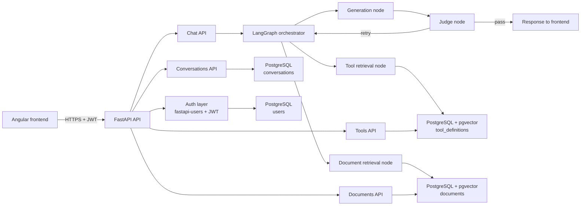

# Cents Backend

Cents is a multi-user RAG chatbot backend built with Python 3.12, FastAPI, LangGraph, and PostgreSQL with pgvector. The service is designed for authenticated users, conversation-scoped chat sessions, document ingestion for retrieval-augmented generation, and tool registration/retrieval for extensible agent workflows.

This backend is intentionally structured so the core application, database, auth, and graph orchestration are separated cleanly. It is ready for a future model layer to be plugged in without rewriting the service boundaries.

## High-level architecture



## What this project includes

- FastAPI app with CORS enabled for the Angular dev origin
- JWT authentication via fastapi-users using PostgreSQL as the backing database
- Conversation CRUD endpoints scoped per user
- Chat endpoint that streams response updates over SSE
- Document upload and chunk storage with pgvector embeddings
- Tool definition registration and retrieval with pgvector search
- LangGraph orchestration for route selection, retrieval, generation, and retry/judge flow
- Async Postgres checkpoint persistence for graph state
- Alembic migration support for schema evolution

## Core backend flow

1. A user signs in with email/password and receives a JWT token.
2. The frontend calls the authenticated routes under /conversations, /chat, /documents, and /tools.
3. The chat flow routes through LangGraph:
   - orchestrator decides whether to retrieve tools, docs, both, or generate directly
   - retrieval nodes query pgvector tables
   - generation node assembles prompt + context
   - judge node determines whether the answer is acceptable or should retry
4. State is persisted through the Postgres-backed checkpoint saver.
5. User-owned data is filtered by the authenticated user id to keep multi-user access isolated.

## Project structure

```text
app/
├── auth/
│   └── users.py                 # fastapi-users setup, JWT auth, user manager
├── db/
│   ├── base.py                  # SQLAlchemy async engine/session
│   ├── models.py                # User, Conversation, Document, ToolDefinition
│   └── migrations/
│       ├── env.py               # Alembic environment config
│       ├── versions/
│       └── ...
├── graph/
│   ├── state.py                 # graph state schema
│   ├── orchestrator.py           # route selection logic
│   ├── retrieval_tools.py        # tool retrieval node
│   ├── retrieval_docs.py         # document retrieval node
│   ├── generation.py             # generation node shell
│   ├── judge.py                 # judge node shell
│   ├── graph.py                 # StateGraph orchestration graph
│   └── checkpointer.py          # AsyncPostgresSaver setup
├── routes/
│   ├── conversations.py         # conversation CRUD
│   ├── chat.py                  # SSE chat endpoint
│   ├── documents.py             # document upload and listing
│   └── tools.py                 # tool registration/listing
├── config.py                    # env-driven settings
├── main.py                      # FastAPI app registration
└── __init__.py
```

## Quick start

The project includes setup scripts for both macOS/Linux and Windows so you can get the app running with minimal manual work.

### macOS / Linux

```bash
chmod +x scripts/setup.sh scripts/start.sh
./scripts/setup.sh
./scripts/start.sh
```

### Windows (PowerShell)

```powershell
Set-ExecutionPolicy -Scope Process -ExecutionPolicy Bypass
./scripts/setup.ps1
./scripts/start.ps1
```

### Manual setup

If you want to do it step by step instead of using the scripts:

```bash
cp .env.example .env
python3 -m venv .venv
source .venv/bin/activate  # Windows: .venv\Scripts\Activate.ps1
python -m pip install --upgrade pip
python -m pip install -r requirements.txt
docker compose up -d
python -m alembic upgrade head
uvicorn app.main:app --reload --host 0.0.0.0 --port 8000
```

## Environment setup

Copy the sample environment file and adjust values:

```bash
cp .env.example .env
```

Required environment variables:

- `DATABASE_URL`
- `JWT_SECRET`
- `CORS_ORIGINS`
- `VECTOR_DIMENSION`
- `APP_NAME`

## Run the backend

### 1) Start Postgres with pgvector

```bash
docker compose up -d
```

### 2) Apply database migrations

```bash
alembic upgrade head
```

### 3) Start the API

```bash
uvicorn app.main:app --reload --host 0.0.0.0 --port 8000
```

### On Windows PowerShell

```powershell
. .\.venv\Scripts\Activate.ps1
uvicorn app.main:app --reload --host 0.0.0.0 --port 8000
```

### On macOS/Linux

```bash
source .venv/bin/activate
uvicorn app.main:app --reload --host 0.0.0.0 --port 8000
```

## Notes for developers

- The project intentionally leaves real model calls and embeddings as `# TODO: model config` placeholders so they can be connected later without disturbing the API or graph structure.
- All user-owned resources are scoped to the authenticated user id.
- The chat route includes a TODO note for rate limiting/concurrency because a single local model worker will naturally serialize requests.
- The PostgreSQL instance is the system of record for users, conversations, documents, and tool metadata.

## Future extension points

- Add the LLM provider and embedding model implementation in the TODO locations.
- Add model-specific prompt templates and retry logic.
- Add document chunking strategies and indexing background jobs.
- Add more tool definitions and execution handlers.
- Add tests for auth, conversation ownership, RAG queries, and SSE streaming.

---

This project is intentionally organized as a clean backend scaffold for a multi-user, document-aware, tool-augmented chatbot.
